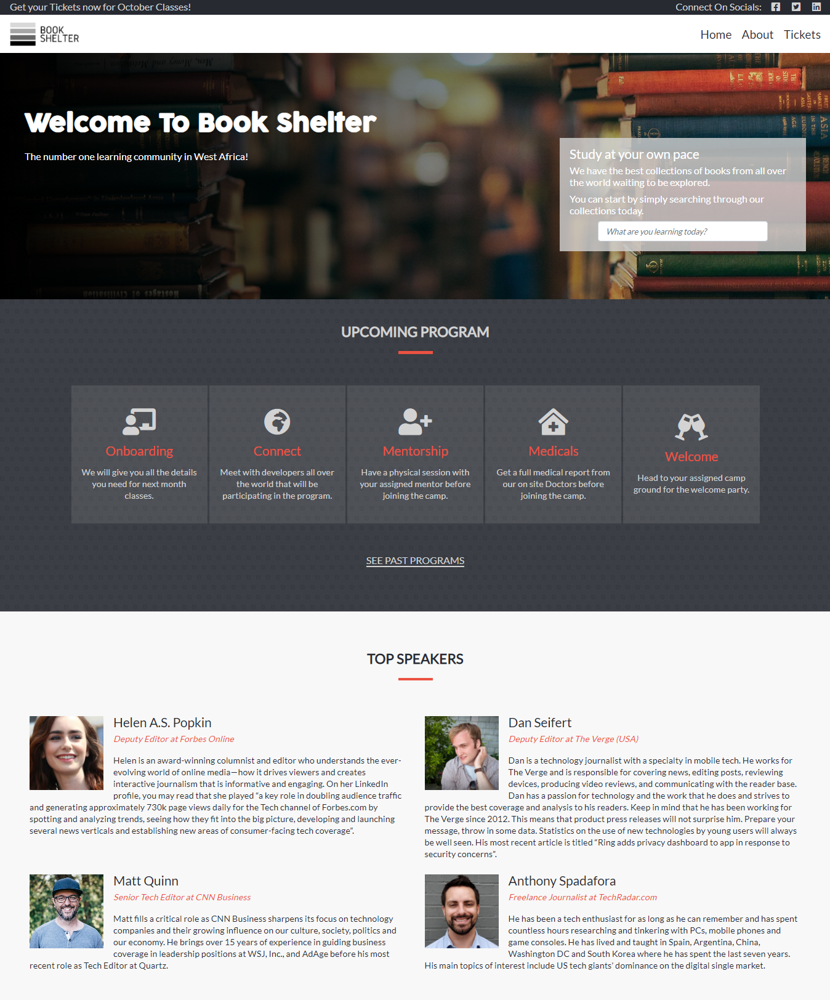

# Book-Shelter
> This project consists of a HTML & CSS Capstone Project, based on an online website for a conference. It's a real-world-like project, built with business specifications.

## Project Requirements

* It consists of 3 HTML pages:
  * the main page, with a menu link to the about page and tickets page
  * the about page
  * the tickets page

* Each of these pages should have versions for 2 different screen sizes:
  * mobile: up to 768px
  * desktop: from 768px

* Follow the guidelines of the given design, including:
  * colors
  * typographies: font face, size and weight
  * layout: composition and space between elements, for the 2 given screen sizes

## Built With

- HTML
- CSS
- Bootstrap

## Dependencies

> Refer to [Linters Config](https://github.com/eananti/linters-config/tree/master/html-css) for dependencies setup guide.

## Presentation Video

[Loom](https://www.loom.com/share/88b905d58e184f7aae32b94fed80001f)

## Live Demo

[Live Demo Link](https://eananti.github.io/Book-Shelter/)

## 👤 Author

- Github: [@eananti](https://github.com/eananti)
- Twitter: [@e_ananti](https://twitter.com/e_ananti)
- Linkedin: [Emeka Ananti](https://www.linkedin.com/in/emekaananti/)

## Acknowledgments

- Great thanks to [Behance](https://www.behance.net/gallery/29845175/CC-Global-Summit-2015) and Cindy Shin for the design inspiration.
- Also, hat tip to [Font Awesome](https://fontawesome.com/icons?d=gallery) and [Google Fonts](https://fonts.google.com/).

## Show your support

Give a ⭐️ if you like this project!
